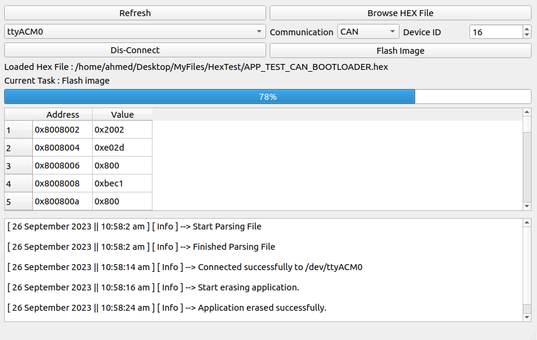

# STM32 Microcontroller Custom Bootloader
The STM32 Microcontroller Bootloader is a robust and versatile firmware solution designed to simplify the software update process for STM32 microcontrollers. It offers support for both USART and CAN communication protocols, providing flexibility to accommodate a wide range of hardware configurations and use cases.

In addition, this project includes a Qt C++ Graphical User Interface (GUI) application that enhances the bootloader's functionality. This GUI facilates the process of flashing images to the STM32 microcontroller, making the software update procedure even more user-friendly.



## Table of Contents
- [Features](#features)
- [Flashing process of CAN Bootloader](#flashing-process-of-can-bootloader)
- [Getting start with CAN Bootloader](#getting-start-with-can-bootloader)
- [Flashing process of USART Bootloader](#flashing-process-of-usart-bootloader)
- [Getting start with USART Bootloader](#getting-start-with-usart-bootloader)


## Features

- **Dual Communication Modes**: Choose between USART and CAN communication protocols based on your hardware configuration, providing adaptability for different project requirements

- **Effortless Hex File Transfer**: The GUI application, developed using Qt C++, lets you to effortlessly parse and transmit hex files to the bootloader, streamlining software updates.


## Flashing process of CAN Bootloader
1. GUI communicates with board that converts USART messages to CAN.
2. On flash there are flag indicates whether application-image is valid or not.
3. If image is valid it waits for x seconds for any CAN-message that indicates about update in flash, where x is a configured time in "BL_Config.h" file.
4. If image isn't valid it waits infinite for any CAN-message that indicates about update in flash.
7. GUI sends command to erase image from flash.
8. GUI will send new application-image.
9. GUI will raise valid image flag and jump to application.


## Getting start with CAN Bootloader
1. Clone the repository to your development environment
```bash
   git clone github.com/AhmedAbd-ElFattah/STM32-Custom-Bootloader
```
2. Configure Bootloader-type to CAN by editing "BL_Config.h" file and define " BOOTLOADER_TYPE " with " USART_BOOTLOADER " value.
3. Assign appropriate configiration of CAN connection, baudrate and so on if needed.
4. Flash STM32-Custom-Bootloader to your microcontroller. (STM32-Custom-Bootloader project has files for STM32CubeIDE project on STM32F407VG microsontroller, so you can import it into your working space).
5. Build GUI and run it.
6. Press on "Refresh" button on gui.
7. Select yout board from combo-box
8. Click on "Connect" button.
9. Click on "Browse Hex File" and select your hex file for application.
10. Change communicaiton to CAN.
11. Enter device id number.
10. Click on "Flash Image"


## Flashing process of USART Bootloader
1. On flash there are two flags first one indicates whether application-image is valid or not, second one indicates application-image needs to be updated or not.
2. GUI sends to application image that there is an avialable update.
3. Application-image raises update image flag, then it resets microcontroller.
4. After reset bootloader reads update flag & valid image flag.
5. When bootloader reads update flag it enters update mode and GUI will do the following
6. GUI will connect to bootloader
7. GUI sends command to erase application image from flash.
8. GUI will send new application-image.
9. GUI will raise valid image flag and jump to application.
10. After any reset of microcontroller, it will find that image if valid and there isn't update flag raised so it will jump to application


## Getting start with USART Bootloader
1. Clone the repository to your development environment
```bash
   git clone github.com/AhmedAbd-ElFattah/STM32-Custom-Bootloader
```
2. Configure Bootloader-type to USART by editing "BL_Config.h" file and define " BOOTLOADER_TYPE " with " USART_BOOTLOADER " value.
3. Assign appropriate configiration of USART connection, baudrate and so on if needed and the same for DMA.
4. Flash STM32-Custom-Bootloader to your microcontroller. (STM32-Custom-Bootloader project has files for STM32CubeIDE project on STM32F407VG microsontroller, so you can import it into your working space).
5. Build GUI and run it.
6. Press on "Refresh" button on gui.
7. Select yout board from combo-box
8. Click on "Connect" button
9. Click on "Browse Hex File" and select your hex file for application.
10. Click on "Flash Image"

Note that application image of application in USART must call "BL_Init_v()" function at initializaion, and linker script must be configured with the same starting address of flash which is configured in "BL_Config.h" file
